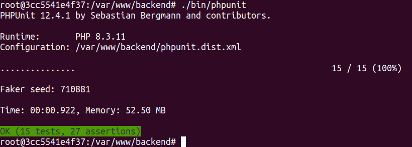
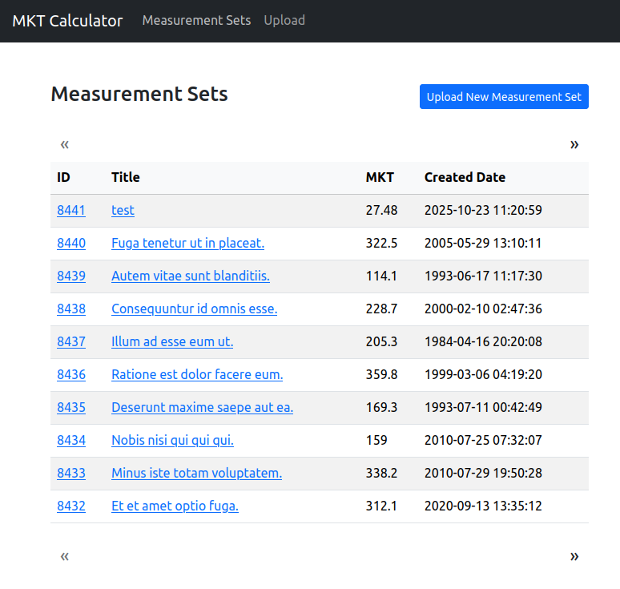
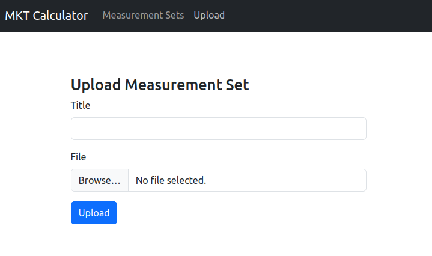

# Mean Kinetic Temperature (MKT)

A full-stack **Symfony + Vue 3 (TypeScript + Vite)** application for calculating and visualizing **Mean Kinetic Temperature (MKT)** from uploaded measurement data (CSV).

---

## 📦 Overview

This project demonstrates:

* A clean **modular backend** using **Symfony 7** and **Doctrine ORM**
* An **asynchronous file processing** (Messenger)
* A **modern Vue 3 + TypeScript frontend** with Axios, Bootstrap, and Chart.js
* Strong separation between **modules**, **requests**, **queries**, and **actions**
* Comprehensive **unit tests** and **realistic data seeding**

---

## ⚙️ Requirements

* Docker & Docker Compose
* Ports [3000, 8000] to serve fronend and backend

---

## 🚀 Quick Setup

### Clone & Start Containers

```bash
git clone https://github.com/khalilst/mkt.git
cd mkt
docker-compose up -d
```

This will start:

* `mkt_php` – Symfony API container
* `mkt_db` – MySQL database
* `mkt_vue` – Vue frontend container (built via Vite)

> You can visit here:
>
> * Frontend → [http://localhost:3000](http://localhost:3000)


> Backend APIs are served from the following path:
>
> * Backend → [http://localhost:8000](http://localhost:8000)
---

### Upload a CSV (Async Job)

You can upload a new dataset via:

* **Frontend:**
  Navigate to **Upload**, choose a `.csv`, and submit.
  There are 4 sample csv files in the samples directory.

* **Backend (API):**

  ```
  POST /api/measurement-sets
  Content-Type: multipart/form-data
  Body:
    title = "Test Run"
    file = measurements.csv
  ```

After uploading:

* A `MeasurementSet` is created.
* A background job (`ProcessMeasurementsFileHandler`) reads the file and saves all measurements.
* Then it call the `CalculateMktAction` to calculate MKT and update the MKT for created MeasurementSet.

* **Note**: At this moment, the messenger uses the sync queue. It uses in-memory queue for testing.

---

### Seed Test Data

Run the seeder fixture to generate random datasets. The MKT for the random dataset is not a valid value.
If you want to test the MKT calculation, try uploading a file.

```bash
docker exec -ti mkt_php php bin/console doctrine:fixtures:load --no-interaction --append --group=init
```

This command creates several `MeasurementSet` entities and their related `Measurement` rows to simulate uploaded temperature data. You can run the command multiple times to generate more data.

---

## 🧩 Architecture Overview

### 🏛️ Modular Symfony Structure

```
backend/src/Module
└── Mkt
    ├── Action
    │   ├── CalculateMktAction.php
    │   ├── MeasurementBatchStoreAction.php
    │   └── MeasurementSetStoreAction.php
    ├── Controller
    │   ├── MeasurementIndexController.php
    │   ├── MeasurementSetIndexController.php
    │   ├── MeasurementSetShowController.php
    │   └── MeasurementSetStoreController.php
    ├── Dto
    │   ├── MeasurementBatchStoreDto.php
    │   ├── MeasurementSetStoreDto.php
    │   └── RawMeasurementDto.php
    ├── Entity
    │   ├── Measurement.php
    │   └── MeasurementSet.php
    ├── Event
    │   └── MeasurementSetCreatedEvent.php
    ├── EventListener
    │   └── ProcessMeasurementSetListener.php
    ├── Factory
    │   ├── MeasurementFactory.php
    │   └── MeasurementSetFactory.php
    ├── Message
    │   └── ProcessMeasurementsFile.php
    ├── MessageHandler
    │   └── ProcessMeasurementsFileHandler.php
    ├── Query
    │   ├── MeasurementChunkQuery.php
    │   ├── MeasurementIndexQuery.php
    │   └── MeasurementSetIndexQuery.php
    ├── Repository
    │   ├── MeasurementRepository.php
    │   └── MeasurementSetRepository.php
    └── ValueObject
        └── MeasurementsFilePayload.php
```

## 🧑‍💻 Developer Notes

* Code follows **SOLID** and **CQRS-inspired** modular structure.
* Tests are self-contained (in-memory DB, no mocks).
* Designed to scale to large CSVs via async job dispatching.

## **Tests**: Functional tests for endpoints.
```
backend/tests/Module
└── Mkt
    ├── Concerns
    │   └── WithUploadFile.php
    ├── Controller
    │   ├── MeasurementIndexControllerTest.php
    │   ├── MeasurementSetIndexControllerTest.php
    │   ├── MeasurementSetShowControllerTest.php
    │   └── MeasurementSetStoreControllerTest.php
    └── Fixtures
        ├── MeasurementsFileFixture.php
        ├── MeasurementsFileWithInvalidMeasurementsFixture.php
        └── MeasurementsFileWithMktFixture.php
```

To run the tests, we need to create the test database only once with the following command:
```
docker exec -ti mkt_php php bin/console doctrine:database:create --env=test && \
docker exec -ti mkt_php php bin/console doctrine:migrations:migrate --env=test --no-interaction

```

Now we can run the tests with the following command:
```
docker exec -ti mkt_php ./bin/phpunit
```


### 🧠 Backend Flow

1. User uploads a file → `MeasurementSetStoreController`
2. Controller calls → `MeasurementSetStoreAction`
3. It creates the `MeasurementSet` and then dispatches `MeasurementSetCreatedEvent`
4. `ProcessMeasurementSetListener` picks up event and dispatches `ProcessMeasurementsFile` to the message bus.
3. `ProcessMeasurementsFileHandler` picks up job (Messenger).
    1. It parses the file in chunks and validates them. It excludes the invalid data.
    2. It calls `MeasurementBatchStoreAction` to create `Measurement` entities.
    3. Then calls `CalculateMktAction` to calculate the MKT.

* **Note**: The `CalculateMktAction` fetches the `Measurement` entities by chunks and sorted by their timestamp by assuming that the user data could be random and it changes the result.

---

### 💻 Frontend (Vue 3 + TypeScript + Vite)

```
.
├── App.vue
├── components
│   ├── Header.vue
│   ├── MeasurementChart.vue
│   ├── MeasurementListItem.vue
│   ├── MeasurementListView.vue
│   ├── MeasurementList.vue
│   ├── MeasurementSetListItem.vue
│   ├── MeasurementSetList.vue
│   ├── PaginatedList.vue
│   └── Pagination.vue
├── composables
│   ├── useFormatDate.ts
│   ├── useMeasurementSets.ts
│   ├── useMeasurementSetUploadForm.ts
│   ├── useMeasurements.ts
│   ├── usePagination.ts
├── main.ts
├── pages
│   ├── MeasurementSetShow.vue
│   ├── MeasurementSetsIndex.vue
│   └── UploadMeasurements.vue
├── router
│   └── index.ts
├── services
│   └── api.ts
├── shared
│   ├── endpoints.ts
│   └── routes.ts
└── types
    ├── mkt.ts
    └── pagination.ts
```

* **Composition API** composables (`useMeasurementSets`, `useMeasurementSetUploadForm`, ...) promote reusability.
* **Axios** handles API requests with interceptors.
* **Bootstrap 5** provides simple, clean styling.
* **vue3-toastify** handles notifications.
* **Chart.js + vue-chart-3** renders measurement graphs.

---

### 🧭 Pages Summary

| Page              | Path        | Description                                           |
| ----------------- | ----------- | ----------------------------------------------------- |
| MeasurementSets   | `/`         | Lists all datasets with **pagination**                |
| Measurements      | `/sets/:id` | Shows a single dataset, its measurements, and a chart |
| Upload            | `/upload`   | Form to upload a new CSV/XML/YML dataset              |
| Not Found         | `/*`        | For invalid paths and invalid set IDs                 |

* **MeasurementSets Page**



* **Measurements Page**


* **Upload Page**



---

## 🧭 License & Author

**Author:** Khalil Laleh
**License:** MIT

> *“Clean architecture, clear data flow, composable frontend — built with care.”*
